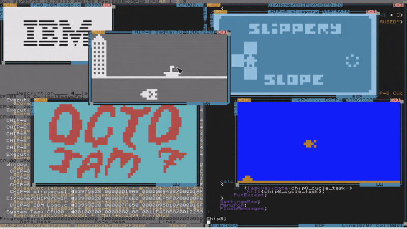

# CHIP-8 Interpreter for ZealOS



To run: `#include "CHIP8"`

## Notes

- To enable/disable modern CHIP-8 support, change the `CHIP8_POST_1990` #define value.

## Keybindings

```
                                Original:  Modern representation:
Original COSMAC VIP and HP48     1 2 3 C    1 2 3 4
used a unique key layout, with   4 5 6 D    Q W E R
keys for 0-9 and A-F.            7 8 9 E    A S D F
Modern interpreter practice is   A 0 B F    Z X C V
to use 4x4 square starting at
key '1' and ending at key 'V'.
```

### Other Keybindings

|Keybinding|Description|
|:-:|:-:|
|Enter|Reset|
|Shift|Increase Screen Size|
|Ctrl|Decrease Screen Size|
|Tab|Pause|
|Backspace|Change ROM|
|Esc|Exit|
|Left/Right Arrow Key|Change Foreground Color|
|Up/Down Arrow Key|Change Background Color|

## TODO

- dynamic interpreter cycle/timers speed, adjusting speed with keybinds
- sound
- SUPER-CHIP support
- debugger

